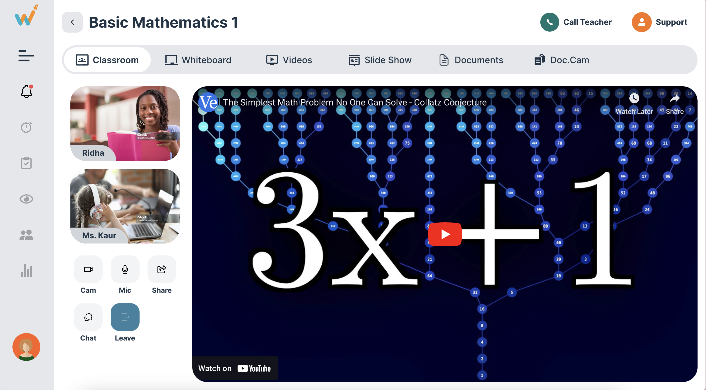

# Tukidoo Screen

React + TypeScript + Vite + TailwindCSS

Tukidoo is a simple online classroom UI developed using ReactJS, designed to connect a students and stream courseworks. This project utilizes Tailwind CSS and Vite for a clean and responsive user interface.

## Features

- **Video Player Screen:** Watch Video (`iframe from yt`)
- **Responsive:** Supports screen sizes above 360px upto 2500px

## Technologies Used

- ReactJS
- TypeScript
- Tailwind CSS

## Screenshot



## Getting Started

To run the Tukidoo application locally, follow these steps:

1. Clone this repository:

```bash
git clone https://github.com/sarkartanmay393/Tukidoo-Reactjs.git

cd Tukidoo-Reactjs
```

2. Install dependencies:

```bash
npm install
```

3. Start the development server:

```bash
npm run dev
```

The application will be accessible at `http://localhost:5173` by default.

## Deployment

I used to deploy the Tukidoo application on Vercel.

## Folder Structure

```plaintext
src/
|-- assets/
|   |-- icons.ts
|   |-- ...
|-- components/
|   |-- Content.tsx
|   |-- Sidebar.tsx
|   |-- ...
|-- App.tsx
|-- main.tsx*
|-- ...
```

## Contributing

Contributions are welcome! Feel free to open issues and pull requests.

---

**Happy Coding!**

```ts
Hare Krishna
```
